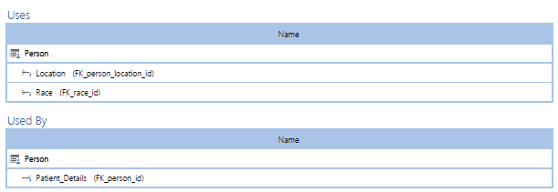

# Global_Disease_Analysis_Project
This is a project which I made for the completion of "Structured Data Management" class for Fall 2020 semester at Yeshiva University. 

# Project Description:

The project focuses around a set of diseases, their mortality rate, patients who have them and then their meta data. Following are the parts on which this project was divided which are as follows:
1. Data model of the project with several entities, relationships and a detailed data dictionary.
2. A physical database with proper referential integrity and data using DDL operations.
3. Showing business change with DML operations.
4. Create a data warehouse using Kimball's strategies, create ETL processes using server side code to load data from the OLTP (Physical) database.
5. Run business analytical queries and show the results in Tableau.
6. How this project will run in a NOSQL Database.
7. How can this project run if AWS is used and how it can be resilient and high-performing and secure.

# Data Model:

# Data Dictionary:

# Physical Database (OLTP):

# DML Showing Business Change:

# DML Showing Referential Behavior:

# Data Warehouse (ETL Processess & Server Side Code):

